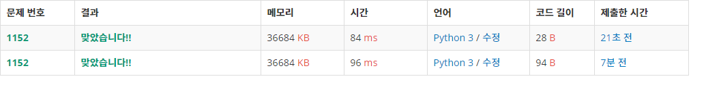

# 3. boj10809(알파벳 찾기)

>https://www.acmicpc.net/problem/10809

```python
alpha=[-1]*26

words = str(input())
for i in range(len(words)):
    order = ord(words[i])-ord('a')
    if alpha[order] == -1:
        alpha[order] = i
    else:
        continue

print(*alpha)
```

숏코딩

```python
print(*map(input().find,map(chr,range(97,123))))
```


# 4. boj2675(문자열 반복)

> https://www.acmicpc.net/problem/2675

```python
for tc in range(int(input())):
    n, words = input().split(" ")
    answer = ""
    for i in words:
        answer += i*int(n)
    print(answer)
```

 숏코딩

```python
for r,_,*s,_ in[*open(0)][1:]:print(''.join(c*int(r)for c in s))
```


# 5. boj1157

>https://www.acmicpc.net/problem/1157

```python
alpha = [0] * 26
words = input().upper()
for i in words:
    alpha[ord(i)-ord('A')] += 1

if alpha.count(max(alpha)) > 1:
    print('?')
else:
    print(chr(alpha.index(max(alpha))+ord('A')))
```

## 숏코딩1

```python
from statistics import*
try:t=mode(input().upper())
except:t='?'
print(t)
```

### 특징

1. statistics 라이브러리 사용

   > https://python.flowdas.com/library/statistics.html

   - `mode()` : 최빈 값


## 숏코딩2

```python
s=input().upper()
m=0
for i in set(s):
 y=s.count(i)
 if m<y:m,c=y,i
 elif m==y:c='?'
print(c)
```

### 특징

1. set사용


## 개선 후 코드

```python
alpha = [0] * 26
for i in input().upper():
    alpha[ord(i)-ord('A')] += 1

print('?') if alpha.count(max(alpha)) > 1 else print(chr(alpha.index(max(alpha))+ord('A')))
```


# 6. boj1152

> https://www.acmicpc.net/problem/1152

```python
words = input().split(" ")
while '' in words:
    del words[words.index('')]
print(len(words))
```

1. 빈칸을 기준으로 input을 받음 (문장을 단어로 쪼개기)
2. 앞 뒤에 빈칸이 들어갈 수 있으므로 while문을 사용해 빈칸을 지워줌


## 숏코딩1

```python
print(len(input().split()))
```

- `split()`의 경우, 문자열이 선행이나 후행 공백을 포함해도 결과는 시작과 끝에 빈 문자를 포함하지 않음

  [출처](https://python.flowdas.com/library/stdtypes.html?highlight=split#str.split)

  -> `split()`을 사용하면 문자열 앞, 뒤에 있는 공백을 신경써줄 필요가 없음



- while문을 사용하지 않아도 되니 시간도 줄었다.


# 7. boj2908

> https://www.acmicpc.net/problem/2908

```python
a, b = input().split()
a = ''.join(reversed(a))
b = ''.join(reversed(b))
print(a) if int(a) > int(b) else print(b)
```

a, b를 입력받아 각각을 역순으로 만들어 `join` 사용 후 비교해서 프린트


## 숏코딩

```python
print(max(input()[::-1].split()))
```

### 특징

- `input()`할 때 바로 역순으로 만듦.
- 그 후 max를 사용해서 바로 print

-> 굳이 내가 한 것처럼 변수에 담을 필요가 없었음


# 8. boj5622


```python
answer = 0
for i in input():
    num = ord(i)-ord('A')
    if num > 21:
        answer += 10
    else:
        if num == 18:
            answer += 8
        elif num == 21:
            answer += 9
        else:
            answer += ((num // 3) + 3)

print(answer)
```


## 숏코딩1

```python
print(sum(5*min(ord(x),88)//16-17for x in input()))
```


## 숏코딩2

```python
print(sum(min(ord(c)-64,25)*28//89+3for c in input()))
```


### 특징

1. `min(ord(c)-64, 25)`를 해준 이유

   - 마지막 숫자인 WXYZ를 처리해주기 위함 

     -> 정확히 말하자면 Z를 Y와 같은 숫자로 만들어주기 위함

2. `min(ord(c)-64, 25)*28`을 해준 이유
   - 숫자 `28`은 그냥 넣은 것 같다.
   - 숫자 `5` 혹은 `27`을 넣어도 가능
3. `min(ord(c)-64, 25)*28//89`를 해준 이유
   - 중간에 pqrs를 처리해주기 위함
   - `28`대신 `5`를 곱할 경우에는 16으로 나눠줘도 되고, `27`을 곱할 경우에는 86을 넣어주면 동일한 결과가 나옴


# 9. boj2941

```python
cro = ['c=', 'c-', 'dz=', 'd-', 'lj', 'nj', 's=', 'z=']

words = input()
cnt = len(words)

for i in range(len(cro)):
    cnt -= (len(cro[i])-1) * words.count(cro[i])

if words.count('dz=') and words.count('z='):
    cnt += 1 * words.count('dz=')

print(cnt)

```

- `dz=`와 `z=`가 겹치는 부분이 있기 때문에 if문을 사용해서 처리해줬다.


## 숏코딩

```python
z=['c=','c-','dz=','d-','lj','nj','s=','z=']
n=input()
for i in z:
    n=n.replace(i,'9')
print(len(n))
```

### 특징

1. `replace()`를 사용해서 문자열을 치환했다.
   - `dz=`를 먼저 치환하고 `z=` 를 치환하기 때문에 겹칠 일이 없다.


# 10. boj1316

```python
cnt = 0
for i in range(int(input())):
    alp = [False]*26
    flag = False
    words = input()
    for j in range(len(words)):
        if alp[ord(words[j])-ord('a')]:
            if words[j - 1] == words[j]:
                continue
            else:
                flag = True
                break
        else:
            alp[ord(words[j])-ord('a')] = True
    if not flag:
        cnt += 1
print(cnt)

```


## 숏코딩

```python
count=0
for i in range(int(input())):
    word=input()
    count+=list(word)==sorted(word, key=word.find)
print(count)
```

https://hbj0209.tistory.com/33


### 특징

1. 내장함수 `sorted()`에서 `key=list.find`를 사용
   - 문자열 순서대로 정렬이 됨.