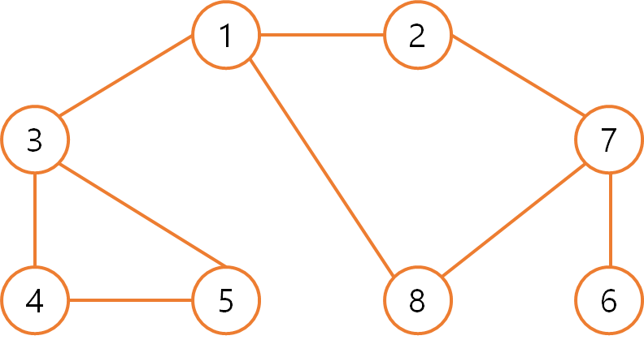

# 탐색(Search)

> 많은 양의 데이터 중에서 원하는 데이터를 찾는 과정


# 자료구조(Data Structure)

> 데이터를 표현하고 관리하고 처리하기 위한 구조

- 삽입(Push) : 데이터를 삽입한다
- 삭제(Pop) : 데이터를 삭제한다


- 오버플로(Overflow) : 특정한 자료 구조가 수용할 수 있는 데이터의 크기를 이미 가득 찬 상태에서 삽입 연산을 수행할 때 발생 (== 저장 공간을 벗어나 데이터가 넘쳐흐를 때)
- 언더플로(Underflow) : 특정한 자료구조에 데이터가 전혀 들어 있지 않은 상태에서 삭제 연산을 수행할 때 발생


## 1. 스택(Stack)

> 선입후출(First In Last Out) == 후입선출(Last In First Out)

- 입력 : 5 - 4 - 3 - 2

- 출력 : 2 - 3 - 4 - 5


- 파이썬에서 스택을 이용할 때는 별도의 라이브러리 사용 X
- 기본 리스트에서 `append()`와 `pop()`메서드를 이용하면 스택 자료구조와 동일하게 동작
  - `append()` : 리스트의 가장 뒤쪽에 데이터 삽입
  - `pop()` : 리스트의 가장 뒤쪽에서 데이터를 꺼냄


## 2. 큐(Queue)

> 선입선출(First In First Out)

- 입력 : 5 - 4 - 3 - 2
- 출력 : 2 - 3 - 4 - 5


- 파이썬에서 큐를 구현할 때는 collections 모듈에서 제공하는 deque 자료구조 활용
  - deque
    - 스택과 큐의 장점을 모두 채택한 것
    - 데이터를 넣고 빼는 속도가 리스트 자료형에 비해 효율적이며 queue라이브러리를 이용하는 것보다 더욱 간단함


## 3. 재귀 함수(Recursive Function)

> 자기 자신을 다시 호출하는 함수


# 탐색 알고리즘 DFS/BFS

시작하기 전 간단히 개념 정리

## 1. 그래프(Graph)

> 노드(Node)와 간선(Edge)으로 이루어져 있음
>
> 노드를 `정점(Vertex)`이라고 표현하기도 함

- 그래프 탐색 : 하나의 노드를 시작으로 다수의 노드를 방문하는 것
- `두 노드는 인접하다(adjacent)` == 두 노드가 간선으로 연결되어 있다.


### 그래프 표현 방식

#### (1) 인접 행렬(Adjacency Matrix)

> 2차원 배열로 그래프의 연결 관계를 표현하는 방식

- 2차원 배열에 각 노드가 연결된 형태를 기록하는 방식

```python
INF = 999999999 # 무한의 비용 선언

# 2차원 리스트를 이용해 인접 행렬 표현
graph = [
    [0, 7, 5],
    [7, 0, INF],
    [5, INF, 0]
]

print(graph)
```

- 연결되지 않은 노드끼리는 무한(Infinity)의 비용이라고 작성

  

#### (2) 인접 리스트(Adjacency List)

> 리스트로 그래프의 연결 관계를 표현하는 방식

- 모든 노드에 연결된 노드에 대한 정보를 차례대로 연결하여 저장

```python
# 행(Row)이 3개인 2차원 리스트로 인접 리스트 표현
graph = [[] for _ in range(3)]

# 노드 0에 연결된 노드 정보 저장(노드, 거리)
graph[0].append((1, 7))
graph[0].append((2, 5))

# 노드 1에 연결된 노드 정보 저장(노드, 거리)
graph[1].append((0, 7))

# 노드 2에 연결된 노드 정보 저장(노드, 거리)
graph[2].append((0, 5))

print(graph)
```


|        | 인접 행렬                                                    | 인접 리스트                                                  |
| ------ | ------------------------------------------------------------ | ------------------------------------------------------------ |
| 메모리 | 모든 관계를 저장하므로 노드 개수가 많을수록 메모리가 불필요하게 낭비됨 | 연결된 정보만을 저장하기 때문에 메모리 효율적으로 사용       |
| 속도   | 특정한 두 노드가 연결되어 있는지에 대한 정보를 얻기 쉬움     | 특정한 두 노드가 연결되어 있는지에 대한 정보를 얻는 속도가 느림(연결된 데이터를 하나씩 확인해야하기 때문) |


## 1. DFS

> 깊이 우선 탐색(Depth-First Search)
>
> 그래프에서 깊은 부분을 우선적으로 탐색하는 알고리즘
>
> **스택** 자료구조 사용


### 1) 동작 과정

1. 탐색 시작 노드를 스택에 삽입하고 방문 처리

2. 스택의 최상단 노드에 방문하지 않은 인접 노드가 있으면 그 인접 노드를 스택에 넣고 방문 처리를 함. 

   방문하지 않은 인접 노드가 없으면 스택에서 최상단 노드를 꺼냄

3. 2번의 과정을 더 이상 수행할 수 없을 때까지 반복



```
1 
1 2
1 2 7
1 2 7 6
1 2 7
1 2 7 8
1 2 7
1 2
1
1 3
1 3 4
1 3 4 5
==> 노드의 탐색 순서 (스택에 들어간 순서) : 1 2 7 6 8 3 4 5
```


```python
# DFS 메서드 정의
def dfs(graph, v, visited):
    # 현재 노드를 방문 처리
    visited[v] = True
    print(v, end=" ")
    # 현재 노드와 연결된 다른 노드를 재귀적으로 방문
    for i in graph[v]:
        if not visited[i]:
            dfs(graph, i, visited)

# 각 노드가 연결된 정보를 리스트 자료형으로 표현(2차원 리스트)
graph = [
    [],
    [2, 3, 8],
    [1, 7],
    [1, 4, 5],
    [3, 5],
    [3, 4],
    [7],
    [2, 6, 8],
    [1, 7]
]

# 각 노드가 방문된 정보를 리스트 자료형으로 표현(1차원 리스트)
visited = [False] * 9

# 정의된 DFS 함수 호출
dfs(graph, 1, visited)

# 1 2 7 6 8 3 4 5
```


## 2. BFS

> 너비 우선 탐색(Breath First Search)
>
> 가까운 노드부터 탐색하는 알고리즘
>
> **큐** 자료구조 사용
>
> - 큐 자료구조에 기초하여 구현이 간단함
> - 구현시 deque 라이브러리를 사용하는 것이 좋음
> - 탐색 수행 시 O(N) 시간 소요
> - 실제 수행 시간은 DFS보다 좋은 편 (DFS는 재귀함수로 구현하기 때문, 이를 완화하기 위해서 DFS에서 스택 라이브러리를 이용해 시간 복잡도를 완화할 수는 있음)


1. 탐색 시작 노드를 큐에 삽입하고 방문처리를 한다
2. 큐에서 노드를 꺼내 해당 노드의 인접 노드 중에서 방문하지 않은 노드를 모두 큐에 삽입하고 방문처리를 한다.
3. 2번의 과정을 더 이상 수행할 수 없을 때까지 반복한다.


```
1
2 3 8
3 8 7
8 7 4 5
7 4 5
4 5 6
==> 노드의 탐색 순서 (큐에 들어간 순서) : 1 2 3 8 7 4 5 6
```

```python
from collections imprt deque

# BFS 메서드 정의
def bfs(graph, start, visited):
    # 큐(Queue) 구현을 위해 deque 라이브러리 사용
    queue = deque([start])
    # 현재 노드를 방문 처리
    visited[start] = True
    # 큐가 빌 때까지 반복
    while queue:
        # 큐에서 하나의 원소를 뽑아 출력
        v = queue.popleft()
        print(v, end=' ')
        # 해당 원소와 연결된, 아직 방문하지 않은 원소들을 큐에 삽입
        for i in graph[v]:
            if not visited[i]:
                queue.append(i)
                visited[i] = True
                
# 각 노드가 연결된 정보를 리스트 자료형으로 표현(2차원 리스트)
graph = [
    [],
    [2, 3, 8],
    [1, 7],
    [1, 4, 5],
    [3, 5],
    [3, 4],
    [7],
    [2, 6, 8],
    [1, 7]
]

# 각 노드가 방문된 정보를 리스트 자료형으로 표현(1차원 리스트)
visited = [False] * 9

# 정의된 BFS 함수 호출
bfs(graph, 1, visited)
```


|           | DFS            | BFS              |
| --------- | -------------- | ---------------- |
| 동작 원리 | 스택           | 큐               |
| 구현 방법 | 재귀 함수 이용 | 큐 자료구조 이용 |

